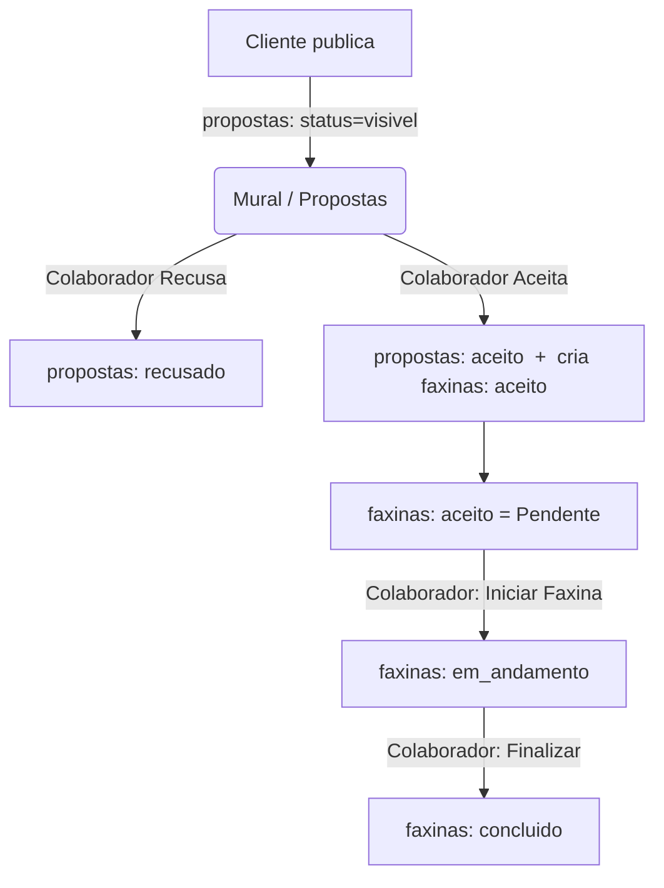
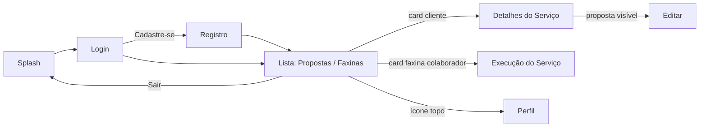

# Casa Limpa — Documentação da Aplicação

Aplicativo de **marketplace de faxina** que conecta **clientes** (que publicam propostas de limpeza) a **colaboradores** (que aceitam e executam o serviço). Feito em **Flutter** com backend no **Firebase** (Authentication + Cloud Firestore).

> Projeto acadêmico — Fatec Rio Preto.

---

## 1. Visão geral

- Dois perfis de uso: **Cliente** e **Colaborador** (uma mesma conta pode ter os dois acessos).
- O **cliente** publica uma **proposta** de faxina (descrição, valor, endereço, data).
- O **colaborador** vê as propostas no mural e pode **Aceitar** ou **Recusar**.
- Ao aceitar, a proposta vira uma **faxina**, que passa pelo ciclo **Pendente → Em andamento → Concluída**.
- Dados em tempo real via `StreamBuilder` (a tela atualiza sozinha quando o Firestore muda).

---

## 2. Stack e tecnologias

| Camada | Tecnologia |
|--------|-----------|
| Front-end | Flutter (Dart), Material 3 |
| Autenticação | Firebase Authentication (e-mail/senha) |
| Banco de dados | Cloud Firestore (NoSQL, tempo real) |
| Upload de imagem (perfil) | `image_picker` |
| Localização/format. | `flutter_localizations`, `intl` |

**Dependências** (`pubspec.yaml`): `firebase_core`, `firebase_auth`, `cloud_firestore`, `image_picker`, `intl`, `flutter_localizations`.

O Firebase é inicializado em `lib/main.dart` com as credenciais do projeto `casa-limpa-5d2ea` antes de rodar o `App`.

---

## 3. Estrutura de arquivos

```
lib/
├── main.dart                          # Inicializa o Firebase e roda o App
├── app.dart                           # MaterialApp + tema + rotas nomeadas
├── splash.dart                        # Tela inicial (escolher perfil)
├── login.dart                         # Login + verificação de acesso
├── registro.dart                      # Cadastro de usuário
├── lista.dart                         # Tela principal (Propostas / Faxinas)
├── cliente_detalhes_servico.dart      # Detalhe de proposta/faxina (visão cliente)
├── colaborador_execucao_servico.dart  # Execução da faxina (visão colaborador)
├── editar_faxina.dart                 # Editar/cancelar proposta
└── analisar_perfil.dart               # Perfil do usuário
```

---

## 4. Backend (Firebase)

### 4.1 Authentication
- Login e cadastro por **e-mail/senha** (`FirebaseAuth`).
- A sessão persiste no navegador (web) — o usuário continua logado após recarregar.
- `currentUser.uid` é a identidade usada para vincular propostas e faxinas ao dono.

### 4.2 Cloud Firestore — Coleções

#### `usuarios/{uid}`
Criado no cadastro (`registro.dart`).

| Campo | Tipo | Descrição |
|-------|------|-----------|
| `id` | string | UID do Firebase Auth |
| `nome` | string | Nome do usuário |
| `email` | string | E-mail |
| `acessoCliente` | bool | Pode entrar como cliente |
| `acessoColaborador` | bool | Pode entrar como colaborador |
| `avaliacaoMedia` | number/null | Média de avaliação (0.0 se colaborador) |
| `foto` | string/null | (reservado) |
| `criadoEm` | timestamp | Data de criação |

> Não existe campo `tipo` — o acesso é decidido pelos booleanos. Uma conta pode ter **os dois** acessos `true`.

#### `propostas/{id}`
A fase de **negociação**. Criada quando o cliente publica.

| Campo | Tipo | Descrição |
|-------|------|-----------|
| `descricao` | string | O que precisa ser limpo |
| `valor` | string | Valor proposto (R$) |
| `endereco` | string | Endereço da faxina |
| `data_faxina` | string | Data (texto, ex.: `15/06/2026`) |
| `status` | string | `visivel` · `aceito` · `recusado` · `cancelada` |
| `clienteId` / `clienteNome` | string | Quem criou |
| `colaboradorId` / `colaboradorNome` | string/null | Quem respondeu (aceitou/recusou) |
| `criadoEm` | timestamp | Data de criação |

#### `faxinas/{id}`
O **trabalho em si**. Criado quando um colaborador aceita uma proposta.

| Campo | Tipo | Descrição |
|-------|------|-----------|
| (mesmos campos da proposta) | | descricao, valor, endereco, data_faxina, cliente*, colaborador* |
| `status` | string | `aceito` · `em_andamento` · `concluido` |
| `propostaId` | string | Referência de volta à proposta de origem |
| `criadoEm` | timestamp | Data de criação da faxina |

---

## 5. Ciclo de vida do status



**Tradução status → rótulo exibido:**

| Status interno | Coleção | Rótulo (cliente) | Rótulo (colaborador) |
|---------------|---------|------------------|----------------------|
| `visivel` | propostas | Aguardando | Nova |
| `aceito` | propostas | — (vira faxina) | Aceita |
| `recusado` | propostas | Recusada | Recusada |
| `aceito` | faxinas | Pendente | Aceita / Pendente |
| `em_andamento` | faxinas | Em andamento | Em andamento |
| `concluido` | faxinas | Concluída | Concluída |

---

## 6. Fluxo de telas e navegação

Rotas nomeadas (definidas em `app.dart`):

| Rota | Tela | Observações |
|------|------|-------------|
| `/` | `SplashPage` | Escolha "Entrar como cliente" / "colaborador" |
| `/login` | `LoginPage` | Recebe o papel via `arguments` |
| `/registro` | `RegistroPage` | Cadastro com checkboxes de acesso |
| `/lista` | `ListaPage` | Tela principal; recebe o papel |
| `/cliente/detalhes` | `ClienteDetalhesServicoPage` | Recebe `{id, colecao, ...dados}` |
| `/colaborador/detalhes` | `ColaboradorExecucaoServicoPage` | Execução da faxina |
| `/perfil` | `AnalisarPerfilPage` | Perfil + reset de senha |
| `/editar` | `EditarFaxinaPage` | Editar/cancelar proposta `visivel` |



---

## 7. Regras de acesso (Cliente x Colaborador)

- Na **splash**, o usuário escolhe entrar como cliente ou colaborador; esse "papel" segue como `arguments` por toda a navegação.
- No **login** (`_temAcesso`), após autenticar, o app consulta `usuarios/{uid}` e **bloqueia** se a conta não tiver o acesso escolhido:
  - escolheu colaborador mas só tem `acessoCliente` → bloqueado (faz `signOut` + mensagem);
  - escolheu cliente mas só tem `acessoColaborador` → bloqueado.
- Conta com **os dois acessos** entra por qualquer um dos dois.
- Contas antigas sem os campos de acesso não são bloqueadas (compatibilidade).

---

## 8. Detalhe das telas

### Splash (`splash.dart`)
Gradiente azul→roxo, logo, e dois botões que levam ao login passando o papel.

### Login (`login.dart`)
Campos E-mail e Senha (label acima, sem ícones). Faz `signInWithEmailAndPassword`, valida o acesso e navega para `/lista`. Link "Cadastre-se" → `/registro`.

### Registro (`registro.dart`)
Nome, E-mail, Senha, Confirmar senha + checkboxes **"Desejo ter acesso de cliente/colaborador"** (ao menos um obrigatório). Cria o usuário no Auth e o documento em `usuarios`.

### Lista (`lista.dart`) — tela central
- Cabeçalho azul curvo + título + contador.
- **Menu inferior** com duas seções que trocam a coleção lida:
  - **Propostas** → lê a coleção `propostas`. Filtros: Todas / Novas / Respondidas.
  - **Faxinas** → lê a coleção `faxinas`. Filtros: Todas / Pendentes / Em andamento / Concluídas.
  - **+** (só cliente): abre o formulário de nova proposta (bottom sheet).
  - **Sair**: logout.
- **Visibilidade** (`_pertenceSecao`):
  - Cliente Propostas: as suas (`visivel`/`recusado`).
  - Colaborador Propostas: mural (`visivel`) + as que ele respondeu (`aceito`/`recusado`).
  - Faxinas: filtra só pelo dono (cliente por `clienteId`, colaborador por `colaboradorId`).
- **Ações no card**: colaborador vê **Recusar/Aceitar** em propostas novas. (Aceitar grava `aceito` na proposta e cria a faxina.)
- Tocar num card abre a tela de detalhe/execução correspondente.

### Detalhes do Serviço (`cliente_detalhes_servico.dart`) — visão cliente
Lê o documento da coleção recebida em `args['colecao']`. Mostra colaborador, dados e status. Ações por status:
- `visivel`: **Editar** / **Cancelar**.
- `aceito`: aviso "Aguardando o colaborador iniciar".
- `em_andamento`: aviso "Aguarde o colaborador finalizar" (**o cliente não conclui**).
- terminal: caixa informativa com o status.

### Execução do Serviço (`colaborador_execucao_servico.dart`) — visão colaborador
Lê a faxina em `faxinas`. Mostra os dados e o botão de ação conforme o status:
- **Iniciar Faxina** → `em_andamento`.
- **Finalizar Serviço** → `concluido` (e volta).
- concluído: botão desabilitado.

### Perfil (`analisar_perfil.dart`)
Mostra nome, e-mail e um chip de acesso (Cliente / Colaborador / Cliente e Colaborador, derivado dos booleanos). Permite escolher foto (`image_picker`) e enviar e-mail de **redefinição de senha**.

### Editar (`editar_faxina.dart`)
Edita descrição/valor/endereço de uma proposta **somente enquanto `visivel`**; permite **cancelar** (status `cancelada`).

---

## 9. Como rodar

```bash
flutter pub get
flutter run -d web-server --web-port 8080
```
Depois abra **http://localhost:8080** no navegador.

> ⚠️ Nesta máquina, `flutter run -d chrome` não conecta no serviço de debug (Wayland + Chrome). Use sempre `-d web-server` e abra a URL manualmente. Hot reload (`r`) e hot restart (`R`) funcionam pelo terminal.

**Para testar o fluxo:** como o login é real, cadastre-se primeiro (cria a conta no Auth + doc em `usuarios`).

---

## 10. Pontos de atenção

- **`status` da faxina ao iniciar**: a faxina é **criada com `status: 'aceito'`** (em `lista.dart`), mas `colaborador_execucao_servico.dart` mostra o botão **"Iniciar Faxina"** apenas quando `status == 'pendente'`. Como nenhuma faxina nasce como `'pendente'`, o botão "Iniciar" não aparece — é preciso alinhar (usar `'aceito'` no `_buildAcao`, ou criar a faxina já como `'pendente'`). **Recomenda-se padronizar para `aceito`** para casar com filtros e badges.
- **Recusa é global**: o status fica num único campo, então recusar uma proposta a remove do mural de todos os colaboradores (não só de quem recusou).
- **Duplicação proposta/faxina**: ao aceitar, mantém-se a proposta como `aceito` (registro em "Respondidas") **e** cria-se a faxina. Os dois documentos coexistem por decisão de projeto.
- **Dados legados**: propostas aceitas antes da separação de coleções não geraram `faxinas` automaticamente.
- **Data como texto**: `data_faxina` é string livre (não há `DatePicker`/validação de data).
```
